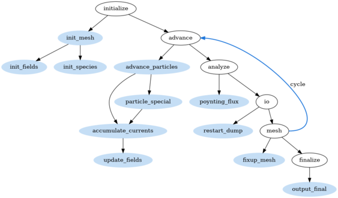

# FleCSI: Tutorial - 00 Control Model Example
<!--
  The above header is required for Doxygen to correctly name the
  auto-generated page. It is ignored in the FleCSI guide documentation.
-->

<!-- CINCHDOC DOCUMENT(user-guide) SECTION(tutorial::control) -->

# Control Model Example



The FleCSI control model provides a mechanism for specializations to
define a set of static control points at which users can register
*actions* that should be executed during a given *phase* of execution.
This example uses a control model that would be sensible for a
*particle-in-cell (PIC)* application. In the above figure, the nodes with
a white fill color are control points (phases).  The nodes with a light
blue fill color are actions. The control model is only concerned with
the execution structure of the code, data dependencies and analysis are
handled through FleCSI's data model. The order of execution of the
phases is set at compile time by the specialization layer, i.e.,
*initialize* -> *advance* -> *analyze* -> *io* -> *mesh* -> *finalize*.
The ordering of actions at each phase is determined by applying a
topological sorting algorithm to the directed acyclic graph (DAG) that
is implied by the dependencies between actions. These dependencies are
specified by the user. This has at least two implications:

1. Actions within a phase may not cycle. If the user defines a graph
   that cycles, a runtime error will be generated.
2. Users cannot add phases. This is the purview of the specailization.

This example attempts to show how the control model mechanism in FleCSI
can be used by a specialization to create a high-level user interface
for registering actions and specifying dependencies between actions
with only local knowledge, i.e., in the simplest case, an action node
only needs to know its direct upstream neighbor.

There are several files in this example:

* ***control-model.cc***<br>
  This is the main program file that combines the various *packages*
  into a single application.

* ***analysis.h***<br>
  Analysis actions. This file also demonstrates registering actions
  under different control points, and outputing the control model
  visualization.

* ***currents.h***<br>
  Accumulate currents action. This file also demonstrates how to specify
  an attribute on an action.

* ***fields.h***<br>
  Advance fields action. This file also demonstrates checking an
  attribute of an upstream action.

* ***io.h***<br>
  I/O action.

* ***mesh.h***<br>
  Mesh actions. This file also demonstrates registering actions under
  different control points.

* ***particles.h***<br>
  Advance particles action.

* ***special.h***<br>
  Particle special action. This file also demonstrates inserting actions
  into the control model without affecting an existing control
  dependency.

* ***species.h***<br>
  Initialize species action.

**Note:** This example uses a node type and phase map that are defined by the
tutorial specialization. The code for the specialization control model
configuration is in *specialization/control*. In particular, the node
type defined in *node_type.h* is a policy for the FleCSI Core *dag_t*
type that adds a `std::function<int(int, char **)>` that is used to
define *actions*, and a `std::bitset<8>` that is used to define
*attributes*.

```cpp
```

<!-- vim: set tabstop=2 shiftwidth=2 expandtab fo=cqt tw=72 : -->
